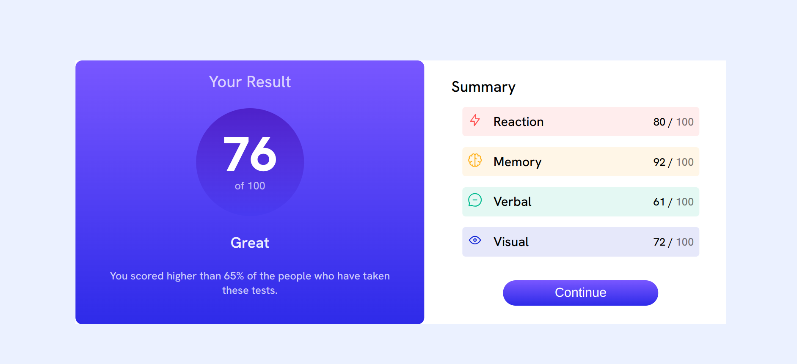

# Frontend Mentor - Results summary component solution

This is a solution to the [Results summary component challenge on Frontend Mentor](https://www.frontendmentor.io/challenges/results-summary-component-CE_K6s0maV). Frontend Mentor challenges help you improve your coding skills by building realistic projects.

## Table of contents

- [Overview](#overview)
  - [The challenge](#the-challenge)
  - [Screenshot](#screenshot)
  - [Links](#links)
- [My process](#my-process)
  - [Built with](#built-with)
  - [What I learned](#what-i-learned)
  - [Continued development](#continued-development)
  - [Useful resources](#useful-resources)
- [Author](#author)
- [Acknowledgments](#acknowledgments)

## Overview

### The challenge

You should be able to:

- View the optimal layout for the interface depending on their device's screen size
- See hover and focus states for all interactive elements on the page
- **Bonus**: Use the local JSON data to dynamically populate the content

### Screenshot

- The following is a screenshot of both the mobile and desktop versions.
  
  

### Links

- Solution URL: [This is the github solution](https://github.com/Rickyngechu/Frontendmentour-1)
- Live Site URL: [Click for live site](https://frontendmentour-1.netlify.app)

## My process

### Built with

- Semantic HTML5 markup
- CSS custom properties
- Flexbox
- Mobile-first workflow

### What I learned

```css
.use-of-hsl-for-clear-colors {
  color: hsla(166, 100%, 37%, 0.104);
}
```

### Continued development

-I would like to continue learning about responsive web development and developing pixel perfect layouts

### Useful resources

- [Tools](Jonas.io/resources) - This helped me for color and web testing tools. I really liked this pattern and will use it going forward.

## Author

- Website - [Erick Ngechu](https://www.your-site.com)
- Frontend Mentor - [@Rickyngechu](https://www.frontendmentor.io/profile/Rickyngechu)
- Twitter - [@Ricky_101com](https://twitter.com/@Ricky_101com)

## Acknowledgments

I do acknowlegd Jonas schemdtman and Kevin powel who have greatly contirbuted to my front end learning journey and skills in general.
